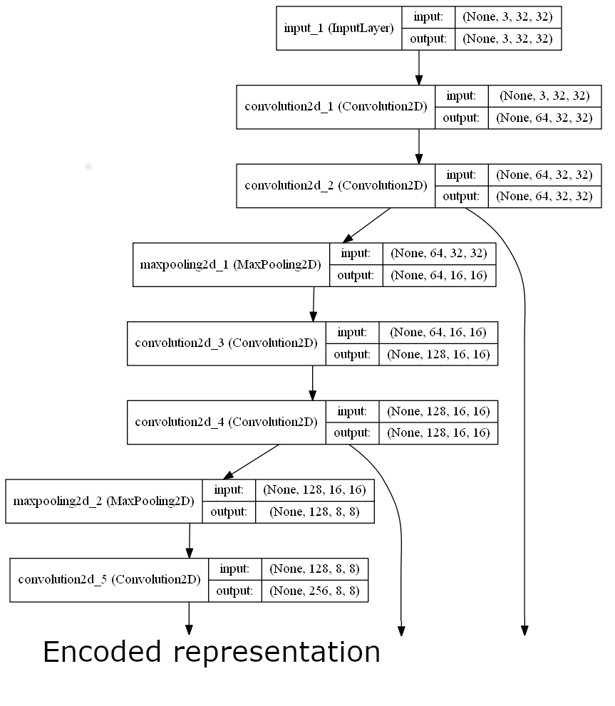
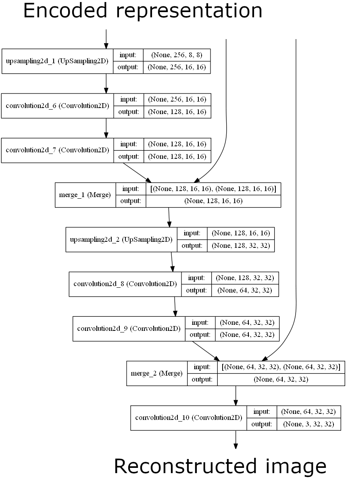
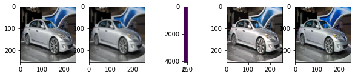

<h1 align=center> Image Super Resolution using Autoencoders</h1>

 


## Project Overview and Import Libraries


```python
from tensorflow.keras.layers import Input, Dense, Conv2D, MaxPooling2D, Dropout
from tensorflow.keras.layers import Conv2DTranspose, UpSampling2D, add
from skimage.transform import resize, rescale
from tensorflow.keras.models import Model
from tensorflow.keras import regularizers
import matplotlib.pyplot as plt
from scipy import ndimage, misc
from matplotlib import pyplot
import tensorflow as tf
import numpy as np
np.random.seed(0)
import re
import os

print(tf.__version__)
```

    2.3.0


---

## What are Autoencoders?


Credit: Autoencoder Schema by <a href="https://blog.keras.io/img/ae/autoencoder_schema.jpg">Francois Chollet, 2016</a>.

<h4 align=center>Encoder Architecture</h4>


## Build the Encoder


```python
input_img = Input(shape=(256, 256, 3))
```


```python
l1 = Conv2D(64, (3, 3), padding = 'same', activation = 'relu', 
            activity_regularizer = regularizers.l1(10e-10))(input_img)

l2 = Conv2D(64, (3, 3), padding = 'same', activation = 'relu', 
            activity_regularizer = regularizers.l1(10e-10))(l1)

l3 = MaxPooling2D(padding = 'same')(l2)
l3 = Dropout(0.3)(l3)

l4 = Conv2D(128, (3, 3),  padding = 'same', activation = 'relu', 
            activity_regularizer = regularizers.l1(10e-10))(l3)

l5 = Conv2D(128, (3, 3), padding = 'same', activation = 'relu', 
            activity_regularizer = regularizers.l1(10e-10))(l4)

l6 = MaxPooling2D(padding = 'same')(l5)

l7 = Conv2D(256, (3, 3), padding = 'same', activation = 'relu', 
            activity_regularizer = regularizers.l1(10e-10))(l6)

encoder = Model(input_img, l7)
```


```python
encoder.summary()
```

    Model: "functional_7"
    _________________________________________________________________
    Layer (type)                 Output Shape              Param #   
    =================================================================
    input_2 (InputLayer)         [(None, 256, 256, 3)]     0         
    _________________________________________________________________
    conv2d_15 (Conv2D)           (None, 256, 256, 64)      1792      
    _________________________________________________________________
    conv2d_16 (Conv2D)           (None, 256, 256, 64)      36928     
    _________________________________________________________________
    max_pooling2d_4 (MaxPooling2 (None, 128, 128, 64)      0         
    _________________________________________________________________
    dropout_2 (Dropout)          (None, 128, 128, 64)      0         
    _________________________________________________________________
    conv2d_17 (Conv2D)           (None, 128, 128, 128)     73856     
    _________________________________________________________________
    conv2d_18 (Conv2D)           (None, 128, 128, 128)     147584    
    _________________________________________________________________
    max_pooling2d_5 (MaxPooling2 (None, 64, 64, 128)       0         
    _________________________________________________________________
    conv2d_19 (Conv2D)           (None, 64, 64, 256)       295168    
    =================================================================
    Total params: 555,328
    Trainable params: 555,328
    Non-trainable params: 0
    _________________________________________________________________


## Build the Decoder to Complete the Network




```python
l1 = Conv2D(64, (3, 3), padding = 'same', activation = 'relu', 
            activity_regularizer = regularizers.l1(10e-10))(input_img)

l2 = Conv2D(64, (3, 3), padding = 'same', activation = 'relu', 
            activity_regularizer = regularizers.l1(10e-10))(l1)

l3 = MaxPooling2D(padding = 'same')(l2)
l3 = Dropout(0.3)(l3)

l4 = Conv2D(128, (3, 3),  padding = 'same', activation = 'relu', 
            activity_regularizer = regularizers.l1(10e-10))(l3)

l5 = Conv2D(128, (3, 3), padding = 'same', activation = 'relu', 
            activity_regularizer = regularizers.l1(10e-10))(l4)

l6 = MaxPooling2D(padding = 'same')(l5)

l7 = Conv2D(256, (3, 3), padding = 'same', activation = 'relu', 
            activity_regularizer = regularizers.l1(10e-10))(l6)

```


```python
l8 = UpSampling2D()(l7)

l9 = Conv2D(128, (3, 3), padding = 'same', activation = 'relu',
            activity_regularizer = regularizers.l1(10e-10))(l8)

l10 = Conv2D(128, (3, 3), padding = 'same', activation = 'relu',
             activity_regularizer = regularizers.l1(10e-10))(l9)

l11 = add([l5, l10])
l12 = UpSampling2D()(l11)

l13 = Conv2D(64, (3, 3), padding = 'same', activation = 'relu',
             activity_regularizer = regularizers.l1(10e-10))(l12)

l14 = Conv2D(64, (3, 3), padding = 'same', activation = 'relu',
             activity_regularizer = regularizers.l1(10e-10))(l13)

l15 = add([l14, l2])

decoded = Conv2D(3, (3, 3), padding = 'same', 
                 activation = 'relu', activity_regularizer = regularizers.l1(10e-10))(l15)

autoencoder = Model(input_img, decoded)
autoencoder_hfenn = Model(input_img, decoded)
```


```python
autoencoder.summary()
```

    Model: "functional_9"
    __________________________________________________________________________________________________
    Layer (type)                    Output Shape         Param #     Connected to                     
    ==================================================================================================
    input_2 (InputLayer)            [(None, 256, 256, 3) 0                                            
    __________________________________________________________________________________________________
    conv2d_20 (Conv2D)              (None, 256, 256, 64) 1792        input_2[0][0]                    
    __________________________________________________________________________________________________
    conv2d_21 (Conv2D)              (None, 256, 256, 64) 36928       conv2d_20[0][0]                  
    __________________________________________________________________________________________________
    max_pooling2d_6 (MaxPooling2D)  (None, 128, 128, 64) 0           conv2d_21[0][0]                  
    __________________________________________________________________________________________________
    dropout_3 (Dropout)             (None, 128, 128, 64) 0           max_pooling2d_6[0][0]            
    __________________________________________________________________________________________________
    conv2d_22 (Conv2D)              (None, 128, 128, 128 73856       dropout_3[0][0]                  
    __________________________________________________________________________________________________
    conv2d_23 (Conv2D)              (None, 128, 128, 128 147584      conv2d_22[0][0]                  
    __________________________________________________________________________________________________
    max_pooling2d_7 (MaxPooling2D)  (None, 64, 64, 128)  0           conv2d_23[0][0]                  
    __________________________________________________________________________________________________
    conv2d_24 (Conv2D)              (None, 64, 64, 256)  295168      max_pooling2d_7[0][0]            
    __________________________________________________________________________________________________
    up_sampling2d_2 (UpSampling2D)  (None, 128, 128, 256 0           conv2d_24[0][0]                  
    __________________________________________________________________________________________________
    conv2d_25 (Conv2D)              (None, 128, 128, 128 295040      up_sampling2d_2[0][0]            
    __________________________________________________________________________________________________
    conv2d_26 (Conv2D)              (None, 128, 128, 128 147584      conv2d_25[0][0]                  
    __________________________________________________________________________________________________
    add_2 (Add)                     (None, 128, 128, 128 0           conv2d_23[0][0]                  
                                                                     conv2d_26[0][0]                  
    __________________________________________________________________________________________________
    up_sampling2d_3 (UpSampling2D)  (None, 256, 256, 128 0           add_2[0][0]                      
    __________________________________________________________________________________________________
    conv2d_27 (Conv2D)              (None, 256, 256, 64) 73792       up_sampling2d_3[0][0]            
    __________________________________________________________________________________________________
    conv2d_28 (Conv2D)              (None, 256, 256, 64) 36928       conv2d_27[0][0]                  
    __________________________________________________________________________________________________
    add_3 (Add)                     (None, 256, 256, 64) 0           conv2d_28[0][0]                  
                                                                     conv2d_21[0][0]                  
    __________________________________________________________________________________________________
    conv2d_29 (Conv2D)              (None, 256, 256, 3)  1731        add_3[0][0]                      
    ==================================================================================================
    Total params: 1,110,403
    Trainable params: 1,110,403
    Non-trainable params: 0
    __________________________________________________________________________________________________


```python
autoencoder.compile(optimizer = 'adadelta', loss = 'mean_squared_error')
```

---

## Create Dataset and Specify Training Routine


```python
def train_batches(just_load_dataset=False):

    batches = 256 

    batch = 0 
    batch_nb = 0 
    max_batches = -1 
    
    ep = 4 

    images = []
    x_train_n = []
    x_train_down = []
    
    x_train_n2 = [] 
    x_train_down2 = []
    
    for root, dirnames, filenames in os.walk("data/cars_train"):
        for filename in filenames:
            if re.search("\.(jpg|jpeg|JPEG|png|bmp|tiff)$", filename):
                if batch_nb == max_batches: 
                    return x_train_n2, x_train_down2
                filepath = os.path.join(root, filename)
                image = pyplot.imread(filepath)
                if len(image.shape) > 2:
                        
                    image_resized = resize(image, (256, 256)) # Resize the image so that every image is the same size
                    x_train_n.append(image_resized) # Add this image to the high res dataset
                    dwn1 = rescale(image_resized, 2)
                    x_train_down.append(rescale(dwn1,0.5))
                    batch += 1
                    if batch == batches:
                        batch_nb += 1

                        x_train_n2 = np.array(x_train_n)
                        x_train_down2 = np.array(x_train_down)
                        
                        if just_load_dataset:
                            return x_train_n2, x_train_down2
                        
                        print('Training batch', batch_nb, '(', batches, ')')

                        autoencoder.fit(x_train_down2, x_train_n2,
                            epochs=ep,
                            batch_size=10,
                            shuffle=True,
                            validation_split=0.15)
                    
                        x_train_n = []
                        x_train_down = []
                    
                        batch = 0

    return x_train_n2, x_train_down2
```

---

## Load the Dataset and Pre-trained Model


```python
x_train_n, x_train_down = train_batches(just_load_dataset = True)
```


```python
autoencoder.load_weights('data/sr.img_net.mse.final_model5.no_patch.weights.best.hdf5')
```

## Model Predictions and Visualizing the Results


```python
encoder.load_weights('data/encoder_weights.hdf5')
```


```python
encoded_imgs = encoder.predict(x_train_down)
```


```python
encoded_imgs.shape
```


    (256, 64, 64, 256)


```python
sr1 = np.clip(autoencoder.predict(x_train_down), 0.0, 1.0)
```


```python
image_index = 251
```


```python
plt.figure(figsize = (20, 20))
i = 1
ax = plt.subplot(10, 10, i)
plt.imshow(x_train_down[image_index])
i += 1
ax = plt.subplot(10, 10, i)
plt.imshow(x_train_down[image_index], interpolation = "bicubic")
i += 1
ax = plt.subplot(10, 10, i)
plt.imshow(encoded_imgs[image_index].reshape((64*64, 256)))
i += 1
ax = plt.subplot(10, 10, i)
plt.imshow(sr1[image_index])
i += 1
ax = plt.subplot(10, 10, i)
plt.imshow(x_train_n[image_index])
plt.show()
```





```python

```
